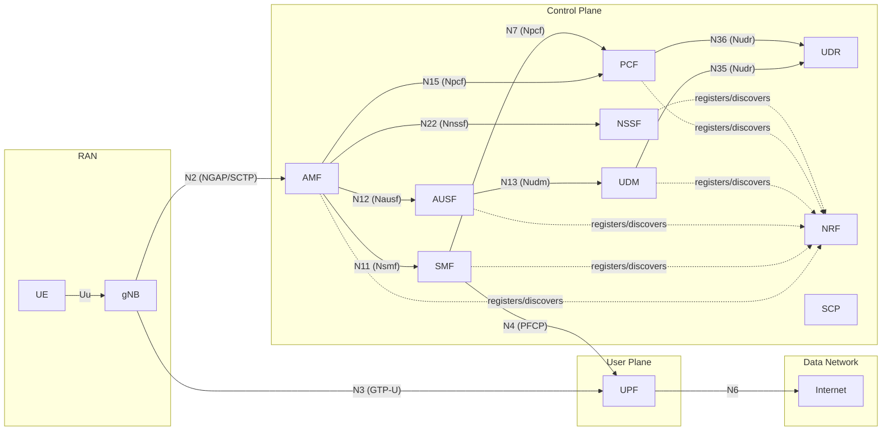

# Architecture Overview

This doc captures the high-level design decisions. For the development plan, see `PLAN_5GC_REL17.md`. For per-NF detail, see each `nf/<nf>/CLAUDE.md`.

## Reference architecture

## Key architectural decisions

| Decision | Choice | Rationale |
|---|---|---|
| Communication model | Direct + delegated (via SCP) | TS 23.501 §6.3.1.0 model A initially, model D when SCP arrives |
| Transport for SBI | HTTP/2 + TLS 1.3, mTLS | TS 29.500 §6.2 |
| Auth for SBI | OAuth2 client_credentials, NRF as AS | TS 33.501 §13.4.1 |
| Service discovery | NRF (no DNS-SD) | TS 23.501 §6.3.1 |
| Internal NF storage | Per-NF state in process; UDR for subscriber data; CHF for charging | Avoid sharing state between NF instances |
| Codecs (NGAP/NAS) | Reuse `github.com/free5gc/aper` (Apache-2.0) | Avoid reimplementing ASN.1 PER |
| UPF data plane | Phase 0–6: kernel GTP module; Phase 7: eBPF/XDP option | Pragmatic MVP, scale later |
| Kubernetes vs Compose | Compose for dev; Helm chart in Phase 7 | Fewer moving parts during development |
| Service mesh | None | SBA already has NRF + SCP; mesh breaks SBI tracing |

## Network topology (Docker)

| Network | Subnet | Purpose | Members |
|---|---|---|---|
| sbi-net | 10.45.0.0/24 | HTTP/2 SBI between control-plane NFs | All CP NFs, postgres, redis, observability |
| n2-net | 10.45.1.0/24 | NGAP/SCTP between gNB and AMF | AMF, gNB simulators |
| n4-net | 10.45.2.0/24 | PFCP between SMF and UPF | SMF, UPF |
| n3-net | 10.45.3.0/24 | GTP-U between gNB and UPF | UPF, gNB simulators |
| n6-net | 10.45.6.0/24 | UPF egress to DN | UPF, DN simulator |
| n9-net | 10.45.9.0/24 | Inter-UPF GTP-U | (future) |

## Observability

Three pillars, all wired from Day 0:

1. **Logs** — JSON to stdout per NF, scraped by Promtail, indexed by Loki, queried via Grafana. 3GPP-aware fields (SUPI, GUTI, correlation_id, spec_ref) enforced by `shared/logging`.
2. **Metrics** — Prometheus, scraped from each NF on port 9090. Standard set: `sbi_requests_total`, `sbi_request_duration_seconds`, plus per-procedure/timer metrics.
3. **Traces** — OpenTelemetry to Jaeger via OTLP. Per-procedure trace, spans per SBI call and per N1/N2/N4 message.

Plus PCAP per NF via tcpdump sidecar. Wireshark dissects NGAP, NAS-5GS, PFCP, GTP-U, and HTTP/2 SBI natively.
