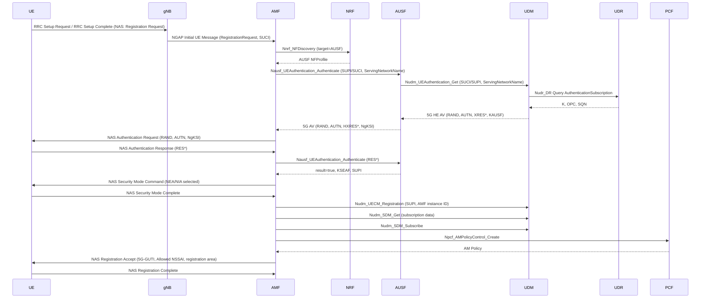

# Procedure: Initial Registration

**Spec:** TS 23.502 §4.2.2.2.2 (UE-initiated initial registration)
**Status:** 🔴 Not implemented (Phase 1 target)
**Primary NF:** AMF
**Other NFs involved:** NRF, AUSF, UDM, UDR, (PCF)

## Sequence

## IEs (key)

- Registration Request: 5GS Registration Type, NgKSI, 5GS Mobile Identity (SUCI/5G-GUTI), UE Security Capability, Requested NSSAI, Last Visited TAI.
- Registration Accept: 5G-GUTI, Equivalent PLMNs, TAI list, Allowed NSSAI, Configured NSSAI, Service Area List, T3512 (periodic update timer).

## Error scenarios to test

| Scenario | Expected behaviour |
|---|---|
| Unknown SUPI | Auth Reject; UE deregistered |
| Mac failure on Authentication Response | Send Auth Failure (Cause: MAC failure); AMF may retry |
| Synch failure (SQN out of range) | Re-sync via AUTS; UDM updates SQN |
| Network slice not allowed | Registration Reject (Cause: 5GMM cause #62); Allowed NSSAI = empty |
| Service Area restrictions | Apply restriction in registration area IE |

## Timers to validate

- T3502 (UE) — wait time before re-registration after rejection
- T3510 (UE) — Registration Request retransmission
- T3511 (UE) — wait time on temporary failure
- T3512 (UE) — periodic registration update
- T3550 (UE) — Registration Complete retransmission
- T3522 (AMF) — Deregistration Request retransmission
- AMF-side guard timers per implementation

## Compliance checklist

- [ ] All IEs encoded per TS 24.501 §8.2 with correct types and lengths
- [ ] SUCI deconcealment via UDM (not in AMF) per TS 33.501 §6.12.2
- [ ] KSEAF derived per TS 33.501 §6.1.3.2
- [ ] NAS security context activated before Registration Accept
- [ ] T3512 sent in Accept; AMF tracks UE periodic update
- [ ] PCF AM Policy retrieval and application
- [ ] UDM subscription so AMF receives data updates
