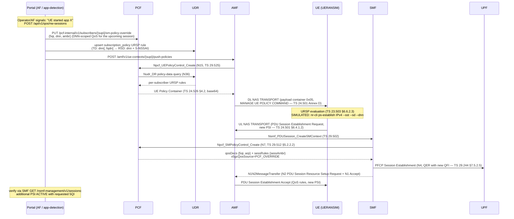

# Procedure: Network-Triggered Additional PDU Session (URSP-based)

**Spec:** TS 23.502 §4.3.2.2.1 (UE-requested PDU Session Establishment) + §4.2.4.3 (UE Policy delivery), TS 23.503 §6.6.2 (URSP), TS 24.526 (URSP encoding), TS 24.501 §6.4.1 (UE-requested PDU session procedures)
**Status:** 🟢 Implemented
**Primary NFs:** PCF, AMF, SMF
**Other NFs involved:** UDR, UPF, UDM
**Trigger surface:** Management Portal `/qos` → "NW-Triggered PDU Session" panel · `POST /api/v1/qos/nw-sessions`

## 1. 3GPP Analysis — why there is no "NW-initiated PDU Session Establishment"

In 5GS, **PDU Session Establishment is always UE-requested** (TS 23.502 §4.3.2.2.1).
Unlike EPS (NW-initiated dedicated bearer activation, TS 23.401 §5.4.1), there is no NAS
message by which the core can directly create a *new* PDU session at the UE. The
standard-conformant mechanism for the network to cause an **additional** PDU session when
the subscriber starts using a new application/service is **URSP steering**:

1. **Application detection** — the network learns the UE is using a new app: UPF traffic
   detection reported via PCC (TS 23.503 §6.2.2.2) or an AF request to the PCF
   (Npcf_PolicyAuthorization, TS 23.503 §6.1.3.18). In this project the detection event is
   simulated by an operator action in the management portal (acting as the AF).
2. **UE Policy update** — the PCF builds an updated URSP rule whose Traffic Descriptor
   matches the new application's traffic (DNN and/or destination FQDN/IP) and whose Route
   Selection Descriptor points at a DNN/S-NSSAI combination **not matching any established
   PDU session**. The PCF delivers it through the AMF via the UE Policy delivery procedure
   (TS 23.502 §4.2.4.3): DL NAS TRANSPORT, Payload container type `0x05`, carrying a
   MANAGE UE POLICY COMMAND (TS 24.501 Annex D).
3. **URSP evaluation at the UE** (TS 23.503 §6.6.2.3) — application traffic matches the new
   rule; no existing PDU session satisfies the Route Selection Descriptor; the UE therefore
   initiates a **UE-requested PDU Session Establishment** for an additional session with a
   new PSI (TS 24.501 §6.4.1.2; up to 15 concurrent PSIs).
4. **QoS binding** — at establishment the SMF performs Npcf_SMPolicyControl_Create (N7,
   TS 29.512 §5.2.2.2); the PCF returns the 5QI/ARP/Session-AMBR configured for this
   trigger, so the additional session comes up with the requested QoS profile end-to-end
   (N1 QoS rules, N2 QoS flow profile, N4 QER).

> **Testbed note:** *stock* UERANSIM v3.2.8 does not implement URSP (it logs
> `Unhandled payload container type [5]` and never ACKs the MANAGE UE POLICY COMMAND), so step 3
> had to be *simulated* by driving a hand-built `nr-cli ps-establish` with explicit S-NSSAI/DNN.
> The **modified UERANSIM** in this repo implements URSP delivery + evaluation: step 3 is now a
> real UE-side decision via `nr-cli <ue> -e "ursp-establish <dnn|app>"`, which picks the
> S-NSSAI/DNN/SSC mode from the matched URSP rule. See
> `docs/procedures/ueransim-modifications.md` (`tools/ueransim/patches/0010,0020`).

## 2. Sequence



## 3. Trigger API (portal orchestration — not a 3GPP SBI)

`POST /api/v1/qos/nw-sessions`

```json
{
  "supi": "imsi-001010000000001",
  "app": "cloud-gaming",
  "dnn": "internet",
  "sst": 1,
  "sd": "000001",
  "5qi": 3,
  "ambr_uplink": "50 Mbps",
  "ambr_downlink": "200 Mbps"
}
```

Response: ordered `steps[]` (`pcf_qos_override`, `ursp_rule_store`, `ursp_push`,
`ue_establish`, `verify`) each with `success`, `duration_ms`, `detail` — plus the resulting
session (`pdu_session_id`, `ue_ip`, `5qi`, `qos_source`).

## 4. Key IEs / data

| Element | Where | Spec |
|---|---|---|
| Traffic Descriptor (DNN, optional FQDN) | URSP rule | TS 24.526 §5.2 |
| Route Selection Descriptor (SSC mode, S-NSSAI, DNN, PDU session type) | URSP rule | TS 24.526 §5.3 |
| Payload container type 0x05 (UE policy) | DL NAS TRANSPORT | TS 24.501 §9.11.3.40 |
| PDU Session ID (new PSI, UE-assigned) | UL NAS TRANSPORT | TS 24.501 §9.4 |
| qosDecs / sessRules (5QI, ARP, AMBR) | Npcf_SMPolicyControl_Create response | TS 29.512 §5.2.2.2 |
| QER (gate + MBR per QFI) | PFCP Session Establishment | TS 29.244 §7.5.2.5 |

## 5. Error cases

| Case | Behaviour |
|---|---|
| UE not registered | `ursp_push` step fails (AMF 404) → orchestration aborts; policy + override remain stored for next registration |
| UE CM-IDLE | AMF returns 409; URSP delivery deferred; UE establishment still attempted (nr-cli triggers Service Request implicitly) |
| Session for same DNN/S-NSSAI already exists | UERANSIM establishes an additional PSI anyway (allowed by TS 24.501 — multiple sessions per DNN are legal, e.g. different SSC modes); the verify step reports the **newest** PSI |
| PCF override rejected (invalid 5QI) | `pcf_qos_override` fails → abort, nothing pushed |
| UERANSIM container not running | `ue_establish` fails with actionable error (start scenario via portal) |
| Max 15 PSIs reached | UERANSIM rejects locally; `verify` finds no new PSI → step fails |

## 6. Validation

See root `CLAUDE.md` → *Feature Validation* → **NW-Triggered Additional PDU Session**, and
the E2E checklist embedded in the portal panel (`/qos`).
