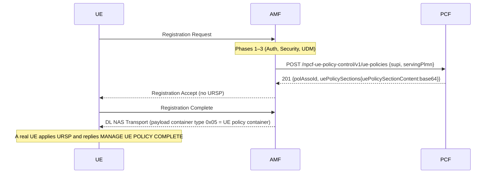

# URSP Delivery via the UE Policy Delivery Service

**Spec**: TS 23.502 §4.2.4.3 · TS 24.501 §5.4.5 + Annex D · TS 29.525 §4.2.2 · TS 24.526 §5.2/§5.3

## Overview

URSP (UE Route Selection Policy) rules tell the UE how to route specific traffic — by
DNN, FQDN, IP address, or app — to the correct PDU session and network slice. They are
delivered to the UE using the **UE policy delivery service** (TS 24.501 Annex D): the PCF
builds a **MANAGE UE POLICY COMMAND**, and the AMF relays it transparently inside a
**DL NAS TRANSPORT** message whose payload container type is **"UE policy container" (0x05)**.

### What this is NOT

URSP is **not** carried in the Configuration Update Command, and **not** in IEI `0x7B`.
In the Configuration Update Command, IEI `0x7B` is *"S-NSSAI location validity information"*
(an NSAC IE) — placing a UE policy container there produces a malformed PDU that decoders
mis-parse. The only spec-correct carrier is DL NAS TRANSPORT with payload container type `0x05`.

> **UERANSIM note**: *stock* UERANSIM v3.2.8 does not implement the UE policy delivery service
> (it logs `Unhandled DL NAS Transport payload container type [5]` and does not reply). The
> **modified UERANSIM** in this repo (`tools/ueransim/patches/0010-ue-policy-delivery.patch`)
> decodes the MANAGE UE POLICY COMMAND, applies the URSP rules, and replies with MANAGE UE POLICY
> COMPLETE — the AMF logs `MANAGE UE POLICY COMPLETE received`. See
> `docs/procedures/ueransim-modifications.md`.

---

## Sequence (delivery after Initial Registration)



On-demand push (`POST /amf/v1/ue-contexts/{supi}/push-policies`) follows the same
`AMF→PCF→AMF→UE` path while the UE is CM-CONNECTED.

---

## Wire format

### Carrier — DL NAS Transport (TS 24.501 §8.7.2)

```
EPD (0x7E) | SHT | DL NAS TRANSPORT (0x68)
  Payload container type   = 0x05  (UE policy container)
  Payload container (LV-E) = length(2) | <MANAGE UE POLICY COMMAND>
```
The message is NAS-security-protected (SHT=0x02) before transmission.

### Payload — MANAGE UE POLICY COMMAND (TS 24.501 §D.5.1, §D.6.2)

```
PTI                                  (1)    PCF-assigned, 0x80–0xFE
message type = 0x01                  (1)    MANAGE UE POLICY COMMAND
UE policy section management list  (LV-E)   length(2) | value
  └─ sublist:
       length                        (2)    = 3 + Σ instructions
       PLMN ID                       (3)    packed BCD (TS 24.008 §10.5.1.13)
       └─ instruction:
            length                   (2)    = 2 + Σ UE policy parts
            UPSC                      (2)    PCF-assigned section code
            └─ UE policy part:
                 length              (2)    = 1 + len(URSP rules)
                 type = 0x01         (1)    URSP
                 URSP rules                 TS 24.526 §5.2
```

### URSP rule (TS 24.526 §5.2)

```
URSP rule length                     (2)
precedence                           (1)
traffic descriptor length            (2)
traffic descriptor                          one+ components (no per-component length)
route selection descriptor list len  (2)
route selection descriptor list             one+ RSDs
```

### Route selection descriptor (TS 24.526 §5.3)

```
RSD length                           (2)
precedence                           (1)
RSD contents length                  (2)
RSD contents                                one+ components
```

### Traffic descriptor component types (TS 24.526 §5.2, Table 5.2.1)

| Code | Component | Value |
|------|-----------|-------|
| `0x01` | Match-all | (none) |
| `0x10` | IPv4 remote address | 4-byte addr + 4-byte mask |
| `0x21` | IPv6 remote address/prefix | 16-byte addr + 1-byte prefix len |
| `0x30` | Protocol id / next header | 1 byte |
| `0x50` | Single remote port | 2 bytes |
| `0x51` | Remote port range | 2-byte low + 2-byte high |
| `0x90` | Connection capabilities | 1-byte count + N bytes (IMS=01, MMS=02, SUPL=04, Internet=08) |
| `0x91` | Destination FQDN | 1-byte len + label format |

### Route selection descriptor component types (TS 24.526 §5.3, Table 5.3.1)

| Code | Component | Value |
|------|-----------|-------|
| `0x01` | SSC mode | 1 byte (no length) |
| `0x02` | S-NSSAI | 1-byte len + SST [+ 3-byte SD] |
| `0x04` | DNN | 1-byte len + APN label format |
| `0x08` | PDU session type | 1 byte (no length): 1=IPv4, 2=IPv6, 3=IPv4v6 |
| `0x10` | Preferred access | 1 byte (no length): 1=3GPP, 2=non-3GPP |

---

## Implementation

| Concern | Location |
|---------|----------|
| URSP → UE policy container encoder | `nf/pcf/internal/policy/ursp.go` (`EncodeURSPRules`) |
| N15 endpoint (returns container as base64) | `nf/pcf/internal/server/n15.go` |
| Fetch container from PCF | `nf/amf/internal/procedures/uce.go` (`FetchUEPolicyContainer`) |
| Send container over DL NAS Transport | `nf/amf/internal/nas/nas.go` (`SendUEPolicyContainer`) |
| Auto-delivery after RegistrationComplete | `nf/amf/internal/nas/nas.go` (`handleRegistrationComplete`) |
| Decoder (debug) | `scripts/decode-ursp.py` |

---

## Validation

```bash
make ueransim
make validate-ursp           # full U0–U9 suite

# Decode the live UE policy container (human-readable URSP rules):
docker exec amf curl -sk --http2-prior-knowledge \
  -X POST https://pcf:8006/npcf-ue-policy-control/v1/ue-policies \
  -H 'Content-Type: application/json' \
  -d '{"supi":"imsi-001010000000001","servingPlmn":"00101"}' | \
  python3 scripts/decode-ursp.py

# On-demand push to a CM-CONNECTED UE:
curl -X POST http://localhost:9002/amf/v1/ue-contexts/imsi-001010000000001/push-policies
docker logs amf | grep "UE policy container sent"   # ursp_version increments

# Codec unit tests (no stack needed):
go test ./nf/pcf/internal/policy/... ./shared/nas/... -run "URSP|DLNASTransport"
```

---

## Error cases

| Condition | Behavior |
|-----------|----------|
| PCF unavailable at registration | Non-fatal: registration completes without URSP |
| UE is CM-IDLE when push is triggered | `ErrNotConnected`; management API returns 409 |
| PCF returns empty container | No DL NAS Transport sent |
| Stock UERANSIM receives container | Logs "Unhandled payload container type [5]"; no ACK (no URSP support) |
| Modified UERANSIM receives container | Decodes + stores URSP, replies MANAGE UE POLICY COMPLETE; AMF logs the ACK |
