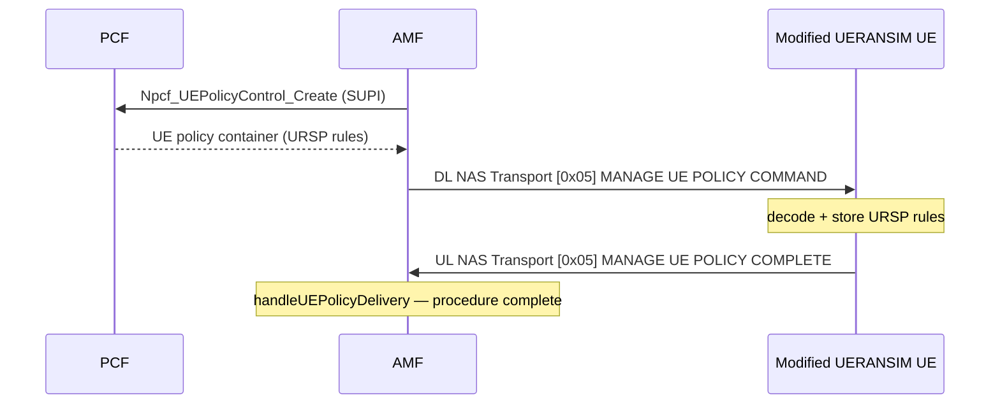

# Modified UERANSIM — UE-side features for end-to-end testing

UERANSIM v3.2.8 lacks UE-side support for several procedures our core implements, so we patch it.
The patches live in `tools/ueransim/patches/` and are applied at Docker build time over a stock
v3.2.8 tarball (see `tools/ueransim/CLAUDE.md` for the build/dev workflow). This document describes
the features added and how to validate them end-to-end.

> **Image:** `5gc/ueransim:dev`, built by `make ueransim` / `make ueransim-build-only`.
> The patch set is the portable artifact — drop `tools/ueransim/patches/` into any UERANSIM v3.2.8
> build to reproduce the modified UE.

## Feature 1 — URSP / UE policy delivery service (`0010`)

**Spec:** TS 24.501 Annex D (UE policy delivery service) · TS 24.526 §5.2/§5.3 (URSP encoding).

At registration the PCF builds URSP rules and the AMF delivers them in a **DL NAS TRANSPORT** with
payload container type **UE policy container (0x05)**, carrying a **MANAGE UE POLICY COMMAND**. Stock
UERANSIM logs `Unhandled payload container type [5]` and never replies.

The modified UE:
1. Decodes the MANAGE UE POLICY COMMAND and the embedded URSP rules (`src/ue/nas/ursp.cpp`), byte-for-byte
   matching the PCF encoder `nf/pcf/internal/policy/ursp.go`.
2. Stores the rule set in the UE NAS context (`NasMm::m_urspPolicy`).
3. Replies with a **MANAGE UE POLICY COMPLETE** in an UL NAS TRANSPORT (payload container type 0x05).

**Core counterpart:** the AMF now handles the inbound 0x05 container —
`handleUEPolicyDelivery` in `nf/amf/internal/nas/nas.go` logs the COMPLETE and closes the
network-requested UE policy management procedure (previously the COMPLETE had nowhere to go because
UERANSIM never sent it).



## Feature 2 — URSP evaluation, introspection & steered session (`0020`)

**Spec:** TS 23.503 §6.6.2 (URSP-based traffic steering) · TS 24.526 §5.2.

Adds `MatchUrspTarget` (`src/ue/nas/ursp.cpp`): given a target (DNN, app name, or FQDN substring) it
selects the highest-precedence matching rule's route selection descriptor (preferring an RSD that
routes to the requested DNN, then FQDN match, then match-all fallback). New `nr-cli` verbs:

| Command | Purpose |
|---|---|
| `nr-cli <ue> -e "ursp-show"` | Dump the stored URSP rules (decoded, human-readable). |
| `nr-cli <ue> -e "ursp-match <dnn\|app\|fqdn>"` | Show which rule/route matches a target (no session). |
| `nr-cli <ue> -e "ursp-establish <dnn\|app\|fqdn>"` | Evaluate URSP and establish the **steered** PDU session using the matched RSD's S-NSSAI/DNN/SSC mode. |

`ursp-establish` replaces the previous workaround where the portal drove a hand-built
`ps-establish IPv4 --sst .. --sd .. --dnn ..`: the session parameters now come from real UE-side URSP
evaluation, as a real UE would do.

## Feature 3 — NW-initiated PDU session modification (`0030`)

**Spec:** TS 23.502 §4.3.3.2 (NW-initiated) and §4.3.3.1 (UE-requested).

There are **two** stock-UERANSIM gaps here, both patched in `0030`:

1. **gNB (NGAP):** the network carries the 5GSM 0xCB inside an NGAP **PDU Session Resource Modify
   Request** (ProcedureCode 26). Stock UERANSIM's gNB has no handler and logs
   `Unhandled NGAP initiating-message received (17)`, so the NAS never reaches the UE. The patch adds
   `receiveSessionResourceModifyRequest` (`src/gnb/ngap/context.cpp`): it forwards each item's NAS-PDU
   to the UE and replies with a PDU Session Resource Modify Response.
2. **UE (NAS):** stock UERANSIM decodes but does not handle the **PDU SESSION MODIFICATION COMMAND
   (0xCB)** — `receiveSmMessage` logged "Unhandled NAS SM message". The modified UE
   (`src/ue/nas/sm/modification.cpp`) handles 0xCB (network-initiated, **PTI=0** as our SMF emits),
   applies the authorized Session-AMBR / QoS rules / QoS flow descriptions, and replies with **PDU
   SESSION MODIFICATION COMPLETE (0xCC)** — closing the §4.3.3.2 loop (the AMF already consumes 0xCC).

It also adds `nr-cli <ue> -e "ps-modify <psi> [--5qi value]"` to originate a UE-requested
MODIFICATION REQUEST (0xC9) for the §4.3.3.1 flow.

## Validation

Bring the stack up with the modified image, then run the checks:

```bash
make ueransim                 # core + obs + modified gNB/UE
make ueransim-mod-e2e         # all checks (script: scripts/validate-ueransim-mod.sh all)

# or individually:
make ursp-e2e                 # URSP COMPLETE round-trip
make qos-mod-e2e              # 0xCB -> 0xCC round-trip
make nw-session-e2e           # URSP-steered additional PDU session
```

Manual log checks:

```bash
docker logs amf  | grep "MANAGE UE POLICY COMPLETE received"   # Feature 1 (new — UE now ACKs)
docker logs ueransim-ue | grep "URSP policy received"          # Feature 1 (not "Unhandled [5]")
docker exec ueransim-ue nr-cli imsi-001010000000001 -e "ursp-show"     # Feature 2
docker exec ueransim-ue nr-cli imsi-001010000000001 -e "ursp-establish ims"
docker logs ueransim-ue | grep "QoS modified by the network"   # Feature 3
docker logs smf  | grep "Modification Complete"                # Feature 3 (loop closed)
```

Codec/matcher unit tests run without a stack (standalone, `g++`): see
`tools/ueransim/CLAUDE.md` §5; the URSP wire format is cross-checked against
`scripts/decode-ursp.py` and `nf/pcf/internal/policy/ursp_test.go`.
